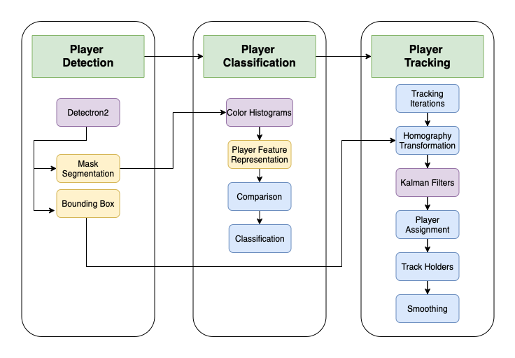

# Introduction

This repository contains code for Football Player Tracking.

We are able to:

1. Detect Players on the Football Pitch
2. Classify players into 5 distinct classes
   1. Team A Outfield Players
   2. Team A Goalkeeper
   3. Team B Outfield Players
   4. Team B Goalkeeper
   5. Referee
3. Provide unique track identifiers for each track even on occasions of player occlusions.

A demo video showcasing the player tracking and classification capabilities can be seen in the video down below.

## Demo

https://user-images.githubusercontent.com/34560370/159212411-25938db2-f400-4952-bc93-db0d1af520e8.mp4

# Overview

Our method contains of 3 main steps, Player Detection, Player Classification and Player Tracking.

## Player Detection

Player detection is performed using Detectron2 to obtain player bounding box and segmentation masks of football players on the pitch.

## Player Classification

The mask segmentations obtained in the Player Detection Step are utilised to compute color histograms as each player's feature representation. Using the player feature representation, we utilise an unsupervised approach to perform similarity comparison against reference images of each class. The class with the highest similarity score is assigned to the target player as its final class.

## Player Tracking

Bounding boxes detected in the Player Detection step are utilised in the Player Tracking step. First, homography transformation is performed to convert image pixel coordinates of players to 2D pitch coordinates. Next, we instantiate kalman filters using both image pixel coordinates and pitch coordinates to perform tracking. Player tracking is performed through the usage of a player assignment workflow which assigns players to their respective track. We also implement a novel track holders implementation to classify detected tracks according to their certainty and characteristics. Lastly, we perform smoothing to output the final track.

## High Level Overview of Source Files

- player_assign_team.py: Performs Player Detection and Classification to classify detected players into their classes.
- player_tracking_ss_v1.py: Performs Player Tracking.
- player_tracking_compute.py: Helper file to perform player tracking.
- visualise_all_players.py: Visualises all players with its corresponding court coordinates as shown in the Demo Video.
- generate_detectron_predictions.py: Generates Detectron Predictions.

## Performing Tracking

An end-to-end workflow will be released soon!
